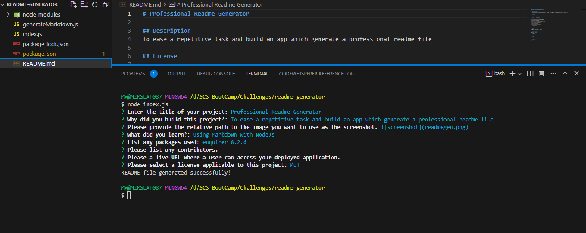

# Professional Readme Generator

## Description
To ease a repititive task by building an app which generate a professional readme file

## Table of Contents

  * [Screenshots](#screenshots)
  * [Usage](#usage)
  * [Installation](#installation)
  * [Credits](#credits) 
  * [Link](#link)
  * [License](#license)

## Screenshots
 
 

## Usage
Using Markdown with NodeJs

## Installation
enquirer 8.2.6

## Credits

## Link
N//A

## License  
MIT
